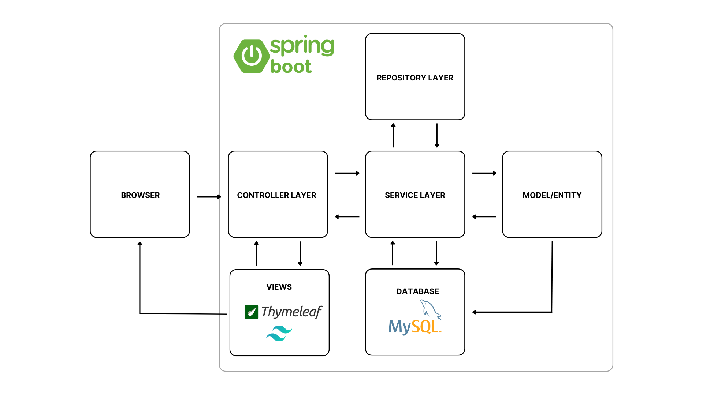
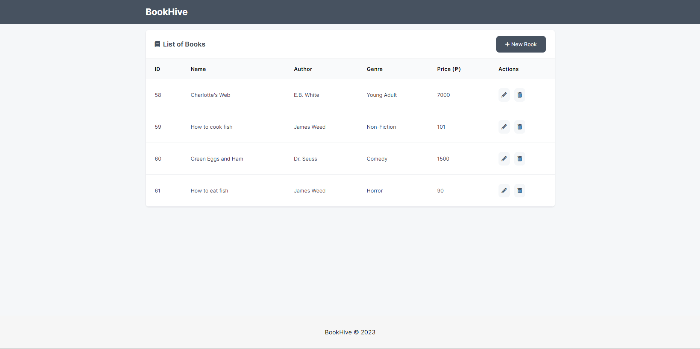
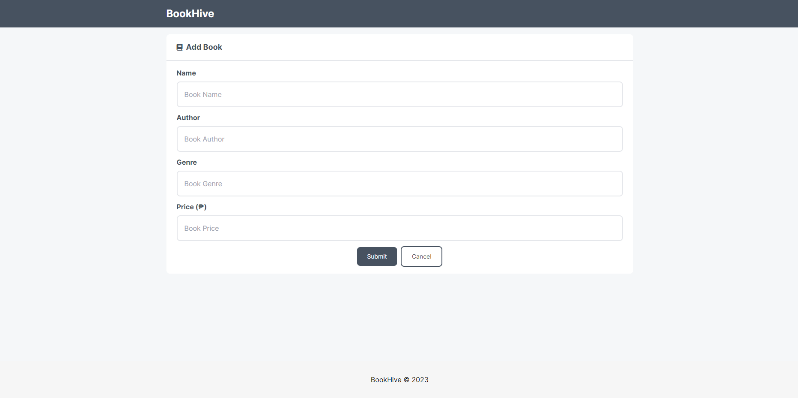

# BookHive - Book Inventory Management System
This is a full-stack web application for managing the inventory of a bookstore. It uses the following technologies:

- [Spring Web](https://docs.spring.io/spring-boot/docs/current/reference/html/web.html): Spring Web is a module of the Spring Framework that provides support for building web applications. It includes features such as HTTP request handling, session management, and web application configuration.

- [Spring Data JPA](https://spring.io/projects/spring-data-jpa): Spring Data JPA is a module of the Spring Framework that provides support for working with Java Persistence API (JPA). It simplifies the process of working with databases by providing a set of common interfaces and implementations for database operations.

- [Thymeleaf](https://www.thymeleaf.org/): Thymeleaf is a Java-based server-side template engine that allows developers to build HTML, XML, and text-based templates. It integrates with Spring to provide a powerful and flexible templating solution for web applications.

- [MySQL JDBC Driver](https://spring.io/guides/gs/accessing-data-mysql/): MySQL JDBC Driver is a JDBC driver that provides connectivity to MySQL databases. It enables Java applications to interact with MySQL databases by providing a standard API for database operations.

- [Spring Boot DevTools](https://www.geeksforgeeks.org/spring-boot-devtools/): Spring Boot DevTools is a set of tools that provides a better development experience when working with Spring Boot applications. It includes features such as automatic application restarts, live reloads of static resources, and improved error reporting.

- [Tailwind CSS Play CDN](https://tailwindcss.com/docs/installation/play-cdn): Webjars for Bootstrap is a way to package the Bootstrap framework as a set of webjars, which are self-contained JAR files that contain web resources such as CSS, JavaScript, and images. It allows developers to easily add Bootstrap to their web applications without having to manually download and configure the framework.

# System Architecture

# Current Features
- View list of books
- Add new books
- Edit existing books
- Delete books

# Future Feautures
- Multiple book genres
- Account management
- Sort books based on category

# Prequisites
The following are tools and software used in the making of this project:
- [Java 17](https://www.oracle.com/java/technologies/downloads/)
- [Oracle OpenJDK 19.0.2](https://openjdk.org/projects/jdk/)
- [IntelliJ IDEA Ultimate](https://www.jetbrains.com/idea/promo/?msclkid=6c29293616161025d6b84d208e6adbdc&utm_source=bing&utm_medium=cpc&utm_campaign=APAC_en_ASIA_IDEA_Branded&utm_term=intellij&utm_content=intellij%20idea)
- [MySQL Community](https://dev.mysql.com/downloads/installer/)


# Running the application
1. Make sure you have Java 17 or higher and MySQL installed on your machine
2. Open the IntelliJ IDE, click open, and select the project directory folder
3. Go to the IntelliJ terminal
4. Run this command:
```bash
  ./mvnw spring-boot:run
```
5. Go to http://localhost:9090/
    
# System Screenshots
Home page:


Add book:


Update Book:


# Contributing

Contributions are always welcome! If you find any issues or have any suggestions, please open a new issue or submit a pull request.

# References
- [Spring Boot CRUD Tutorial with IntelliJ IDEA, MySQL, JPA, Hibernate, Thymeleaf and Bootstrap](https://www.youtube.com/watch?v=u8a25mQcMOI&t=4814s)
- [Conditionals in Thymeleaf](https://www.baeldung.com/spring-thymeleaf-conditionals)
- [Get started with Tailwind CSS](https://tailwindcss.com/docs/installation/play-cdn)